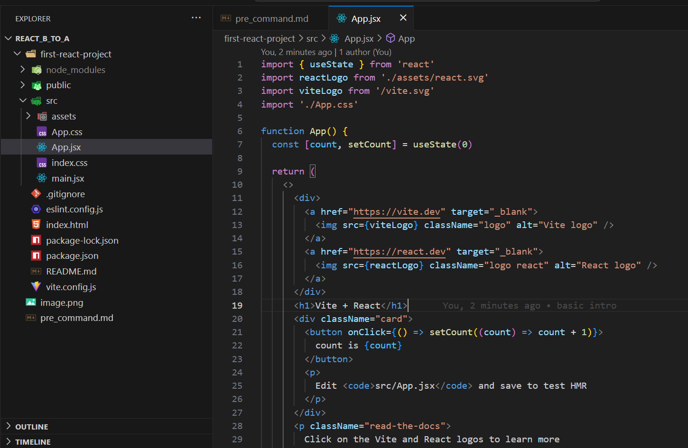
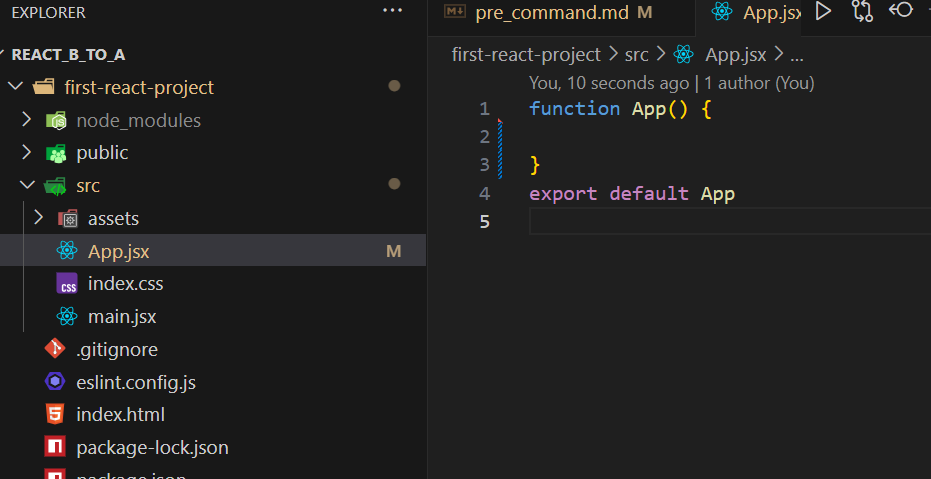
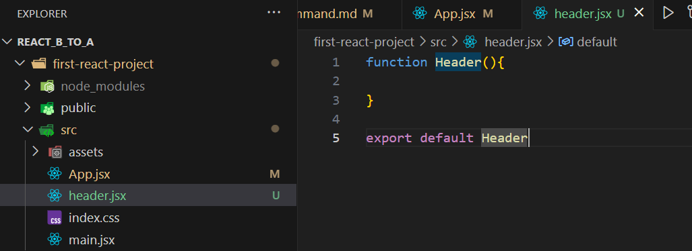
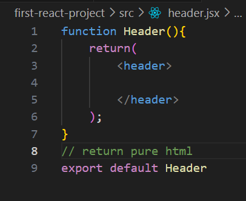
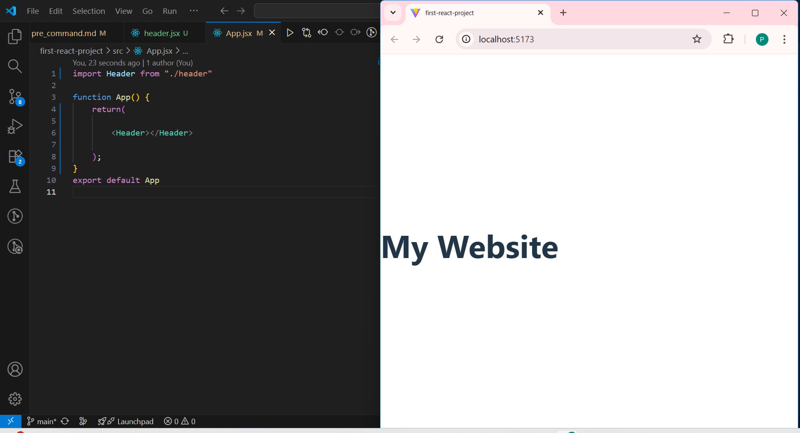
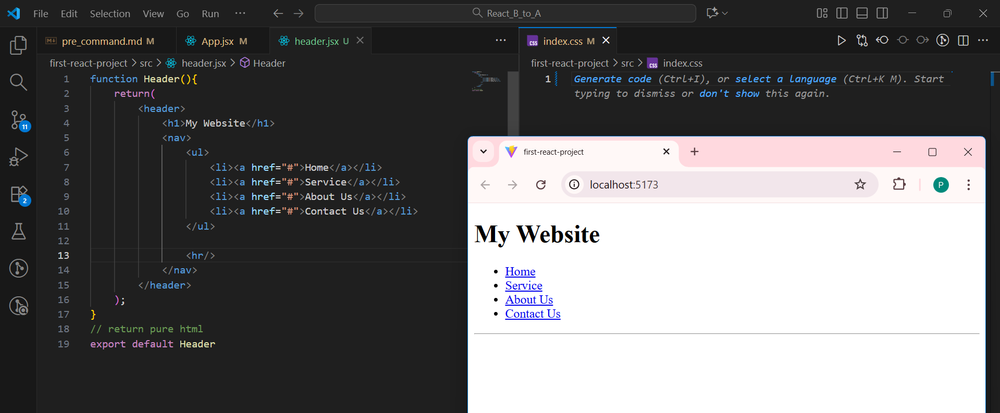
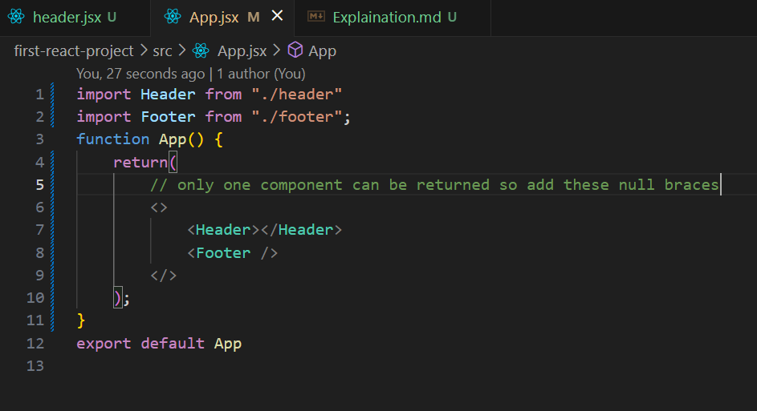
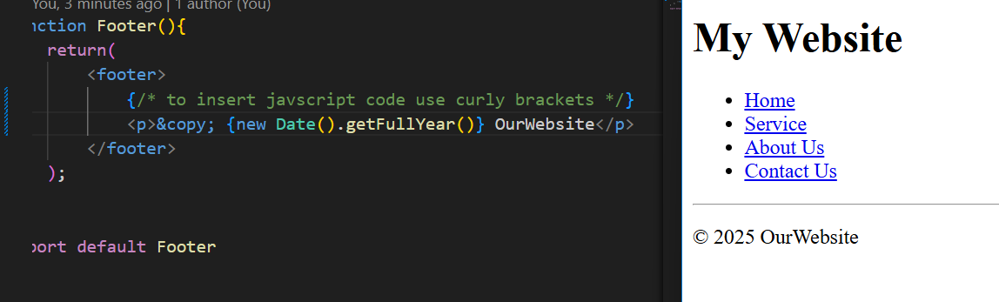

 # Folder Structure
<ul>
<li>
node module folder contain the libraries n all usefull for our project
<li>
public contain public asset like fonts photos etc
<li>
asset folder of src get bundled during final output while public asset are not and they are genrally available through url
<li>
jsx are javascript xml file
<li>
index.css is main file for application
<li>
index.html is main entry point 

### Earlier

### Only needed

remove app.css and app.jsx from start

---

# Designing new Component

 

* to use javascript use { }

