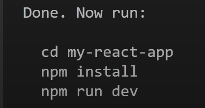

# To create project:
npm-> node package manager

1. npm create vite@latest -> vite is a development server replacemnt to create react app
2. choose react framework
3. Javascript
4. now run printed on screen
5. npm run dev-> to run development server

 

---
---

 # Folder Structure
<ul>
<li>
node module folder contain the libraries n all usefull for our project
<li>
public contain public asset like fonts photos etc
<li>
asset folder of src get bundled during final output while public asset are not and they are genrally available through url
<li>
jsx are javascript xml file
<li>
index.css is main file for application
<li>
index.html is main entry point 
